# Comprehensive Project Audit

## 1. Audit metadata

| Field                                  | Value                                                                                                                                         |
| -------------------------------------- | --------------------------------------------------------------------------------------------------------------------------------------------- |
| Audit date                             | 2026-07-15                                                                                                                                    |
| Repository                             | `/Users/alptalhayazarwork/personal/portfolio-website`                                                                                         |
| Branch                                 | `main` (`main...origin/main`)                                                                                                                 |
| Audited commit                         | `1f2964fc6fa5073677db0fd52fc37378d3854455`                                                                                                    |
| Working-tree state at preflight        | 162 tracked files modified by mode only (`100644 -> 100755`), no staged files, and seven pre-existing untracked files                         |
| Runtime                                | Node.js `v24.17.0`; npm `11.17.0`; Git `2.50.1`                                                                                               |
| Locked application stack               | Next.js `16.1.7`; React/React DOM `19.2.4`; TypeScript `5.9.3`; Tailwind CSS `4.2.1`; Vitest `4.1.0`; Playwright `1.58.2`; Nodemailer `8.0.2` |
| Standard used for accessibility review | WCAG 2.2, Level A/AA criteria where applicable; no whole-site conformance claim                                                               |
| Release-readiness decision             | **Not ready**                                                                                                                                 |
| Finding counts                         | **P0: 0 / P1: 0 / P2: 16 / P3: 5**                                                                                                            |

### Scope and source classification

The audit covered the maintained source and configuration surfaces named in the request: manifests and lockfile; Next.js, TypeScript, ESLint, Tailwind/PostCSS, Vitest, Playwright, and Vercel configuration; all `src/app`, `src/components`, `src/hooks`, `src/lib`, `src/types`, and `src/proxy.ts` code; `scripts`, `e2e`, `public`, and root documentation; and relevant untracked project documentation.

Generated, dependency, cache, and third-party trees were classified but not recursively audited: `.git`, `node_modules`, `.next`, `out`, `coverage`, `playwright-report`, `test-results`, `.pnpm-store`, `.worktrees`, tool caches, and ignored redesign/vendor copies. Temporary screenshots were written only under `/tmp/portfolio-audit-2026-07-15`.

The tracked worktree contains **no content delta from HEAD**. `git diff --summary` reports 162 mode changes; `git diff --numstat` reports zero added/deleted lines for every text file; and the binary favicon hash matches HEAD. Consequently:

- Findings in application or documentation content are labeled `BOTH`: they exist in committed HEAD and in the current worktree.
- The file-permission anomaly is labeled `WORKTREE`.
- The six untracked `.codex/prompts/*.md` files and `docs/plans/2026-03-22-linkedin-forceget-positioning.md` are user-owned. They were treated as non-authoritative governance/context material and were not changed.

The prompt files are `codex-5-4-editorial-technical-redesign-compact.md`, `codex-5-4-editorial-technical-redesign.md`, `figma-make-light-theme-followup.md`, `figma-make-portfolio-redesign-editorial-technical.md`, `figma-make-portfolio-redesign.md`, and `gpt-5-4-figma-redesign-integration.md` under `.codex/prompts/`.

### Methodology

1. Captured repository, branch, commit, dirty state, staged/unstaged/untracked state, file modes, ignored surfaces, tool versions, and a maintained-file inventory.
2. Read configuration, implementation, tests, documentation, and import paths; used a conservative TypeScript import graph before describing modules as unreachable.
3. Ran every requested existing verification command independently. No dependency was installed and no lockfile was changed.
4. Built and ran the production application locally. Exercised Turkish and English routes, invalid routes, redirects, themes, responsive layouts, navigation, form validation, metadata routes, console/network behavior, and reduced-motion mode. No contact submission was allowed to deliver email.
5. Performed safe, low-volume static and local probes for CSRF behavior, rate limiting, HTML email construction, spam classification, health semantics, and malformed JSON. No production service was mutated or attacked.
6. Passively inspected the canonical public site with GET/HEAD requests and compared observable source-related behavior to local behavior.
7. Retrieved only primary/authoritative sources for version-sensitive framework, accessibility, analytics, and advisory claims. Sources are linked at the relevant claim and were accessed on 2026-07-15.

Secret-bearing files were not opened or printed. Existing environment scripts were allowed to consume local variables, but the report records only filenames, validation outcomes, and non-sensitive warnings.

## 2. Executive summary

### Overall condition

This is a coherent, visually polished portfolio with a sound basic App Router structure, good TypeScript discipline, a successful production build, passing lint/type checks, and 74 passing unit tests. The main Turkish and English experiences render correctly at representative mobile, tablet, and desktop widths, with no observed horizontal overflow or meaningful local CLS. Core input validation, exact-origin checking, CSP nonce propagation, schema limits, TLS verification, and secret/server boundaries show deliberate security work.

The repository is nevertheless **not ready for a release sign-off**. No P0 or P1 issue was proven, but 16 material P2 issues form a concentrated risk cluster:

- intended `robots.txt` and sitemap endpoints return 403 locally and in production;
- direct dependencies include currently reported high/moderate advisories;
- contact reliability depends on process-local CSRF state, and the abuse controls can both fail open and silently discard plausible legitimate messages;
- health checks do not test dependency health;
- persisted dark mode reproducibly causes a React hydration recovery;
- contrast, mobile-menu keyboard behavior, and form error/status semantics fail concrete accessibility expectations;
- analytics is loaded without an in-app consent mechanism while its documentation claims controls that do not exist;
- the declared coverage workflow is broken, critical integration paths are mocked or absent, and production environment precedence can let local development values satisfy a production validation.

### Evidence-backed strengths

- `npm run lint`, `npm run type-check`, both environment validators, `npm run test:run`, and `npm run build` all passed in the audited worktree.
- The lockfile root manifest agrees with `package.json`; no second committed package-manager lockfile exists.
- The contact route applies bounded Zod validation (`src/app/api/contact/route.ts:18-32`), CSRF and origin checks, a honeypot, and TLS-enabled SMTP configuration (`src/app/api/contact/route.ts:177-190,234-245`).
- CSP nonces were present on all 18 inspected Next.js script elements in the production page, and the response included HSTS, frame denial, MIME-sniffing protection, referrer policy, permissions policy, and CSP (`src/proxy.ts:139-176`).
- Turkish-root and English routes provide correct `lang`, canonical, and alternate-language metadata on valid pages. `/tr/` redirects to `/`; unsupported and nested invalid routes return 404 and are not indexable.
- The production build generated 13 static route entries without compile/type errors, and the browser smoke pass found no horizontal overflow at 360x800, 768x1024, or 1440x900.
- `npm audit` reported no critical package advisory. Several high advisories were not directly reachable through the app features identified in this review; this is reflected in P2 rather than P1 severity.

### Top risks and first actions

1. Move CSRF state to deployment-safe storage or a stateless signed design, then add a two-instance test.
2. Upgrade the directly affected framework/mail dependencies through a verified dependency change and rerun the full test/build/browser matrix.
3. Correct the proxy matcher/path policy so metadata routes are served, then verify both local and public responses.
4. Make rate-limit failure behavior explicit, namespace fallback policies, encode HTML email fields at the output boundary, and replace silent spam success with a reviewable handling path.
5. Repair the accessibility and hydration defects and restore an executable coverage/E2E release gate.

### Blockers and unmeasured areas

- `npm run e2e` was blocked before tests by a Turbopack `Permission denied (os error 13)` panic in the current environment. The configured Playwright Chromium binary was also absent, and package/browser installation was prohibited.
- Coverage was **not measured** because `@vitest/coverage-v8` is absent; the declared coverage command exits before collecting data.
- Lighthouse/standard lab CWV scores, field CWV, and INP were not measured. A local unthrottled production-browser diagnostic is reported separately and is not a substitute.
- Firefox, WebKit/Safari, a real screen reader, 200% zoom/reflow, production SMTP delivery, real Upstash failure/recovery, and multi-region Vercel behavior were not exercised.
- A clean `npm ci` install was prohibited. The ignored local `node_modules` is pnpm-shaped and `npm ls` reports 422 extraneous packages, so clean-install parity remains unverified.
- LinkedIn returned anti-bot status 999 to the passive checker; link validity is therefore unverified, not classified as broken.

## 3. System and data-flow map

### Architecture summary

The application is a Next.js App Router deployment. `src/proxy.ts` runs before page and API handling, performs the `/tr` canonical redirect, applies API rate limiting, writes request-context/nonce headers, and adds security response headers. The root layout reads request headers to choose `tr` or `en`, emits structured data/theme/bootstrap/analytics elements, and mounts a client-side portfolio tree. Portfolio content is typed data in `src/lib/content/portfolio`; `/` and `/en/` select that content and derive metadata through `src/lib/seo/portfolio-metadata.ts`.

The currently reachable visual implementation is `src/components/portfolio/**`. The parallel `src/components/pages`, `src/components/layout`, `src/components/theme`, and most `src/components/ui` implementation is not reachable from current App Router roots; it remains in lint/type-check scope and is still described by portions of the README.

```mermaid
flowchart TD
    B["Browser request"] --> P["src/proxy.ts"]
    P --> R["Canonical /tr redirect or path rejection"]
    P --> L["API rate limit"]
    P --> H["Request context + locale + CSP nonce headers"]
    H --> PG["Page/layout route"]
    H --> API["Route Handler"]
    PG --> C["Typed locale content"]
    C --> M["Metadata + structured data"]
    C --> UI["Client portfolio components"]
    API --> V["Validation / CSRF / origin / spam"]
    V --> E["Nodemailer"]
    L --> U["Upstash Redis or in-memory policy"]
```

### Required flow 1: browser request -> proxy -> headers/rate limit -> page/API

`src/proxy.ts:118-178` processes every matcher-covered request. `/tr` canonicalization runs first; a substring-based sensitive-path check runs next; API paths then select a per-endpoint policy and call `checkRateLimitRedis`; finally a 128-bit Web Crypto nonce and request-context headers are forwarded and security headers are added. The matcher at `src/proxy.ts:181-190` excludes Next static/image paths and the favicon, but not metadata routes. The sensitive-path list at `src/proxy.ts:21-27` incorrectly includes `robots.txt` and `sitemap.xml`, producing AUD-001.

### Required flow 2: locale routing -> content -> metadata -> portfolio

`src/lib/i18n/routing.ts:1-9` exposes only `tr` and `en`, with Turkish at `/` and English at `/en/`. `src/lib/content/portfolio/index.ts` selects typed content, `src/lib/seo/portfolio-metadata.ts` builds canonical/alternate/social metadata, and `src/app/page.tsx` plus `src/app/[lang]/page.tsx` render `PortfolioPage`. Spanish content remains maintained in `src/lib/content/portfolio/es.ts` but is intentionally not public according to current routing. Invalid one-segment locale routes return 404, but their metadata falls back inconsistently; see AUD-020.

### Required flow 3: contact form -> CSRF/session -> API -> validation -> email

`ContactForm` uses `useCSRFSecurity` to GET `/api/csrf-token/`, persists token/session state in session storage, and passes both to `useContactSubmission`. The client POSTs JSON plus `x-session-id`. `src/app/api/contact/route.ts` parses JSON, validates the session header/token, applies Zod validation and honeypot/spam checks, builds text/HTML mail, and sends with Nodemailer. Process-local token storage (AUD-003), output encoding (AUD-005), spam false positives (AUD-006), and error/status semantics (AUD-011/AUD-019) are the main breaks in this flow.

### Required flow 4: environment -> validation -> build -> Vercel runtime

`scripts/validate-env.ts` loads an ordered set of environment files through `src/lib/env-loading.ts`, validates server and public variables through `src/lib/env-validation.ts`, and is invoked by `npm run build`. `vercel-build` additionally decrypts `.env.production`. The Vercel configuration adds a host redirect and API CORS headers. Production validation currently allows `.env.local` to override `.env.production` (AUD-016); local and deployment build paths are not identical; and health/logging cannot validate or expose actual dependency readiness (AUD-007/AUD-018).

## 4. Perspective scorecard

| Coverage-map perspective                                       | Status     | Evidence-based rationale                                                                                                                                                                                     |
| -------------------------------------------------------------- | ---------- | ------------------------------------------------------------------------------------------------------------------------------------------------------------------------------------------------------------ |
| 1. Repository state and governance                             | Needs work | No content drift or staged work, but all 162 tracked files have mode-only worktree changes; no CI configuration exists; documentation and active source disagree.                                            |
| 2. Product and portfolio effectiveness                         | Needs work | Positioning and dossiers are strong, but recruiter/client verification lacks resume/download and project repository/demo links; a 4+/5+ claim needs owner confirmation.                                      |
| 3. Architecture and framework usage                            | Needs work | App Router and request flow are coherent, but CSRF state is process-local, all active sections hydrate as clients, pages are dynamic/private, and a large parallel component tree is not App-root reachable. |
| 4. Functional correctness and reliability                      | Needs work | Main routes and validation work, but persisted dark mode hydrates incorrectly, contact delivery can fail by instance, plausible messages can be silently discarded, and malformed JSON maps to 500.          |
| 5. Security, privacy, and abuse resistance                     | Needs work | Strong CSP/origin/schema foundations coexist with dependency advisories, HTML email output-encoding gaps, fail-open Redis behavior, telemetry governance gaps, and misleading health semantics.              |
| 6. Accessibility                                               | Needs work | Valid landmarks/headings/skip link and implicit form labels are present, but contrast, overlay keyboard management, form announcements/associations, and motion preference handling need work.               |
| 7. UX, visual design, and responsive behavior                  | Needs work | The visual system is polished and did not overflow tested widths, but dark-mode hydration, low-contrast tokens, menu keyboard leakage, and unannounced form state affect the experience.                     |
| 8. Performance and Core Web Vitals                             | Needs work | Local production diagnostics showed low CLS/no long tasks, but every active section is client-side, local JS decoded near 898 KB, and standardized/field CWV plus INP were not measured.                     |
| 9. SEO, discovery, and social sharing                          | Needs work | Valid pages have good canonical/hreflang/social metadata, but live robots/sitemap are 403 and invalid-locale/PWA metadata is inconsistent.                                                                   |
| 10. Internationalization and content integrity                 | Needs work | Turkish and English are public and tested; Spanish content exists but is not routed; invalid-route metadata and 4+/5+ English claims are inconsistent.                                                       |
| 11. Contact API, email, and runtime integrations               | Needs work | Validation and SMTP TLS settings are deliberate, but CSRF deployment state, email encoding, spam handling, limiter failure behavior, health semantics, and production delivery remain material concerns.     |
| 12. Testing and quality engineering                            | Needs work | 74 unit tests pass, but coverage cannot run, E2E was blocked, only Chromium is configured, and critical API/deployment paths are mocked or uncovered.                                                        |
| 13. Deployment, operations, and observability                  | Needs work | Build succeeds, but production env precedence, ineffective readiness checks, compiled-away app logger calls, deployment redirect drift, and no CI/release gate reduce confidence.                            |
| 14. Dependencies, compatibility, and supply chain              | Needs work | Lockfile/manifests agree, but audit reports high/moderate issues in direct dependencies and no clean-install/license-policy/automated update gate is present.                                                |
| 15. Maintainability, documentation, DX, and compliance signals | Needs work | Type/lint quality is good, but 5,892 LOC is not App-root reachable, onboarding docs describe obsolete behavior, the MIT license file is absent, and privacy/accessibility claims overstate evidence.         |

## 5. Verification results

| Command/check                                       | Exit |   Duration | Result                                                                                                   | Failure classification                                          |
| --------------------------------------------------- | ---: | ---------: | -------------------------------------------------------------------------------------------------------- | --------------------------------------------------------------- |
| `git status --short --branch` (preflight)           |    0 |        <1s | `main...origin/main`; 162 tracked mode-only changes; seven pre-existing untracked files; no staged files | Pass / repository-state evidence                                |
| `git diff --summary`                                |    0 |        <1s | 162 `mode change 100644 => 100755` entries                                                               | Worktree hygiene issue                                          |
| `git diff --name-status`                            |    0 |        <1s | 162 modified paths                                                                                       | Worktree evidence                                               |
| `git diff --cached --name-status`                   |    0 |        <1s | Empty                                                                                                    | Pass                                                            |
| `git diff --numstat` plus favicon hash comparison   |    0 |        <1s | Zero text additions/deletions; binary favicon hash matched HEAD                                          | Pass / baseline-worktree classification                         |
| `npm run lint`                                      |    0 |      8.20s | ESLint completed with no reported error                                                                  | Pass                                                            |
| `npm run type-check`                                |    0 |      5.04s | `tsc --noEmit` completed                                                                                 | Pass                                                            |
| `npm run validate:env`                              |    0 |      3.26s | Development schema valid; `.env.local` consumed; no values printed                                       | Pass, local configuration only                                  |
| `npm run validate:env:production`                   |    0 |      3.26s | Production schema valid; warning that email destination differs from Gmail account; no values printed    | Pass with configuration warning                                 |
| `npm run test:run`                                  |    0 |      6.86s | 19 files, 74 tests passed; Vitest-reported test duration 3.94s                                           | Pass                                                            |
| `npm run test:coverage`                             |    1 |      0.46s | Aborted because `@vitest/coverage-v8` is missing                                                         | Repository tooling/configuration defect; coverage not measured  |
| `npm run build`                                     |    0 |     12.00s | Production compilation succeeded; 13 route entries generated; same non-sensitive email warning           | Pass                                                            |
| `npm run e2e`                                       |    1 |      7.75s | Dev server failed before tests: Turbopack panic, `Permission denied (os error 13)`                       | Execution-environment/tooling blocker                           |
| Playwright Chromium launch smoke                    |    1 |      0.63s | Configured Chromium headless shell missing                                                               | Execution-environment blocker; installation prohibited          |
| System-Chrome local production QA harness           |    0 |      8.07s | Route/theme/responsive/form/console/network observations captured at three viewports                     | Pass with findings; not the repository E2E suite                |
| axe-core `4.10.3` via system Chrome                 |    0 |      5.43s | Contrast and landmark findings reproduced; incomplete results not promoted to defects                    | Pass with accessibility findings                                |
| Local production performance diagnostic             |    0 |      6.77s | LCP candidate ~976-980ms, CLS 0-0.000068, zero observed long tasks; unthrottled/no field data            | Diagnostic only, not Lighthouse/CWV certification               |
| `npm audit --json`                                  |    1 |      8.68s | 12 vulnerable package nodes: 0 critical, 7 high, 3 moderate, 2 low; 644 dependencies inspected           | Dependency findings; package severity is not app exploitability |
| `npm audit --omit=dev --json`                       |    1 |      1.29s | Three production package nodes: Next high, Nodemailer high, PostCSS moderate                             | Dependency findings                                             |
| Passive `https://www.alptalha.dev/` GET/HEAD checks |    0 | low volume | Root 200; robots/sitemap 403; apex 307 to `www`; GitHub link 200; LinkedIn blocked checker with 999      | Source defect plus deployment drift/third-party limitation      |

No failed command was retried because none showed a transient application failure: coverage was deterministically missing a package, E2E failed before tests on a host permission error, and Playwright reported an absent browser binary.

## 6. Findings index

| ID      | Severity  | Scope    | Confidence | Validation      | Category                    | Title                                                                            |
| ------- | --------- | -------- | ---------- | --------------- | --------------------------- | -------------------------------------------------------------------------------- |
| AUD-001 | P2 Medium | BOTH     | High       | Reproduced      | SEO / proxy                 | Proxy blocks the intended robots and sitemap routes                              |
| AUD-002 | P2 Medium | BOTH     | High       | Reproduced      | Supply chain                | Direct production dependencies have current advisories                           |
| AUD-003 | P2 Medium | BOTH     | High       | Reproduced      | Contact reliability         | CSRF validity is process-local and refresh can use stale client state            |
| AUD-004 | P2 Medium | BOTH     | High       | Reproduced      | Abuse resistance            | Redis failure opens the limiter and fallback policies collide                    |
| AUD-005 | P2 Medium | BOTH     | Medium     | Reproduced      | Email security              | Untrusted fields are interpolated into HTML email without output encoding        |
| AUD-006 | P2 Medium | BOTH     | High       | Reproduced      | Product / contact           | Broad spam rules silently acknowledge plausible legitimate messages              |
| AUD-007 | P2 Medium | BOTH     | High       | Reproduced      | Operations                  | Health reports configuration presence, not dependency readiness                  |
| AUD-008 | P2 Medium | BOTH     | High       | Reproduced      | React reliability           | Persisted dark mode triggers hydration recovery                                  |
| AUD-009 | P2 Medium | BOTH     | High       | Reproduced      | Accessibility               | Text and placeholder tokens fail WCAG contrast expectations                      |
| AUD-010 | P2 Medium | BOTH     | High       | Reproduced      | Accessibility               | Mobile menu leaks keyboard focus and cannot close with Escape                    |
| AUD-011 | P2 Medium | BOTH     | High       | Static evidence | Accessibility               | Form errors and status changes are not programmatically associated or announced  |
| AUD-012 | P2 Medium | BOTH     | High       | Static evidence | Maintainability             | A large parallel UI implementation is not reachable from App Router roots        |
| AUD-013 | P2 Medium | BOTH     | High       | Static evidence | Documentation / DX          | Onboarding and operational documents materially disagree with the implementation |
| AUD-014 | P2 Medium | BOTH     | High       | Reproduced      | Privacy / compliance signal | Analytics loads without the controls claimed by project documentation            |
| AUD-015 | P2 Medium | BOTH     | High       | Reproduced      | Quality engineering         | Coverage is non-executable and critical runtime flows lack an integration gate   |
| AUD-016 | P2 Medium | BOTH     | High       | Static evidence | Release configuration       | Production validation can be satisfied by development-local environment values   |
| AUD-017 | P3 Low    | WORKTREE | High       | Reproduced      | Repository hygiene          | Every tracked file is executable and world-writable in the worktree              |
| AUD-018 | P3 Low    | BOTH     | High       | Reproduced      | Observability               | Production compilation removes application-owned logger events                   |
| AUD-019 | P3 Low    | BOTH     | High       | Reproduced      | API correctness             | Malformed JSON returns 500 and exposes parser detail                             |
| AUD-020 | P3 Low    | BOTH     | High       | Reproduced      | Metadata / i18n             | Invalid-locale, PWA, asset, and experience metadata are inconsistent             |
| AUD-021 | P3 Low    | BOTH     | Medium     | Inferred        | Accessibility / motion      | JavaScript motion continues when reduced motion is requested                     |

## 7. Detailed findings

### AUD-001 — Proxy blocks the intended robots and sitemap routes

- **Severity:** P2 Medium
- **Confidence:** High
- **Scope:** BOTH
- **Validation status:** Reproduced
- **Category:** SEO / proxy / deployment
- **Estimated effort:** Small

**Impact and affected users/systems.** Crawlers and operators cannot retrieve the repository's intended crawl directives or URL inventory. Both endpoints return 403 on the canonical public site, so this is deployed behavior rather than a local-only mismatch. It does not prove a crawl outage: Google treats most `robots.txt` 4xx responses as if no robots file exists, and a small, well-linked site may be discovered without a sitemap. It still disables the project's explicit discovery controls. See Google's [robots response handling](https://developers.google.com/crawling/docs/robots-txt/robots-txt-spec) and [sitemap guidance](https://developers.google.com/search/docs/crawling-indexing/sitemaps/overview) (accessed 2026-07-15).

**Root cause.** `robots.txt` and `sitemap.xml` are classified as sensitive substrings before the App Router metadata handlers can execute. The broad matcher includes both routes.

**Evidence.** `src/proxy.ts:21-27` puts both names in `SENSITIVE_PATHS`; `src/proxy.ts:127-129` returns 403 on any pathname containing an entry; `src/proxy.ts:181-190` does not exclude metadata routes. The intended handlers exist at `src/app/robots.ts:7-15` and `src/app/sitemap.ts:8-24`. Local production and `https://www.alptalha.dev/` probes both returned 403 for `/robots.txt` and `/sitemap.xml`. Next.js documents metadata files as public conventions and shows proxy matchers excluding metadata routes in its [metadata-file](https://nextjs.org/docs/app/api-reference/file-conventions/metadata) and [Proxy](https://nextjs.org/docs/pages/api-reference/file-conventions/proxy) documentation (accessed 2026-07-15).

**Safe reproduction.** Build/start locally, then run `curl -i http://localhost:3000/robots.txt` and `curl -i http://localhost:3000/sitemap.xml`; each returns `HTTP 403` and `Forbidden`. A single low-volume GET to each canonical public URL reproduced the same status.

**Recommended remediation.** Remove these public metadata paths from the sensitive list and explicitly exclude or bypass metadata conventions in the proxy matcher. Retain traversal/dotfile protections using exact normalized path rules rather than generic substring matching.

**Verification criteria.** Local and deployed endpoints return 200 with `text/plain` and XML respectively; generated contents match the canonical domain and locale routes; a route-level test passes through the actual proxy rather than invoking the sitemap generator directly.

**Dependencies/sequencing.** Fix before relying on search-console submission or SEO monitoring. No other finding blocks it.

### AUD-002 — Direct production dependencies have current advisories

- **Severity:** P2 Medium
- **Confidence:** High
- **Scope:** BOTH
- **Validation status:** Reproduced
- **Category:** Dependencies / supply chain / security
- **Estimated effort:** Medium

**Impact and affected users/systems.** The deployed framework and mail library are within affected ranges for current advisories. `npm audit --omit=dev` reports Next as high, Nodemailer as high, and PostCSS as moderate. The broad audit reports 0 critical, 7 high, 3 moderate, and 2 low package nodes. These are package-level severities, not 12 proven application exploit paths, so the finding is P2 rather than P1.

**Root cause.** The lockfile pins Next `16.1.7` and Nodemailer `8.0.2` (`package-lock.json:7172-7174,7260-7262`) through dependency declarations at `package.json:27-43`.

**Evidence and applicability.** The Next advisories retrieved during the audit cover RSC denial of service, Proxy authorization bypass/incomplete fixes, and CSP nonce handling: [GHSA-8h8q-6873-q5fj](https://github.com/vercel/next.js/security/advisories/GHSA-8h8q-6873-q5fj), [GHSA-267c-6grr-h53f](https://github.com/vercel/next.js/security/advisories/GHSA-267c-6grr-h53f), [GHSA-26hh-7cqf-hhc6](https://github.com/vercel/next.js/security/advisories/GHSA-26hh-7cqf-hhc6), and [GHSA-ffhc-5mcf-pf4q](https://github.com/vercel/next.js/security/advisories/GHSA-ffhc-5mcf-pf4q) (accessed 2026-07-15). No Server Functions/`use server`, Cache Components, `next/image`, `beforeInteractive`, WebSocket upgrade handling, Pages Router, or authorization-protected page was found; this reduces demonstrated reachability for the highest-impact variants. CSP nonce handling and Proxy are used, so all Next advisories cannot be dismissed. Nodemailer's [raw-message advisory](https://github.com/advisories/GHSA-q4gf-8mx6-v5v3) affects the locked version, but `src/app/api/contact/route.ts:177-245` does not use the `raw` option. Vite findings are development-tool exposure. Sources accessed 2026-07-15.

**Safe reproduction.** Run `npm audit --json` and `npm audit --omit=dev --json` against the unchanged lockfile. The commands exit 1 with the counts recorded in section 5.

**Recommended remediation.** In a dedicated dependency change, update Next and its coupled packages to an advisory-fixed compatible release (the retrieved Next advisories identify `16.2.6` as the complete fix point for the cited chain), update Nodemailer to its fixed line, review PostCSS/transitives, and examine changelogs before accepting lockfile changes. Do not blanket-force incompatible majors.

**Verification criteria.** A clean `npm ci` followed by both audit commands, lint, type-check, unit, coverage, build, and browser/E2E passes; advisory results are documented with reachability decisions; CSP/Proxy/contact behavior remains intact.

**Dependencies/sequencing.** Coordinate with AUD-015 so the upgrade has executable regression gates. Address before the next production release.

### AUD-003 — CSRF validity is process-local and refresh can use stale client state

- **Severity:** P2 Medium
- **Confidence:** High
- **Scope:** BOTH
- **Validation status:** Reproduced
- **Category:** Contact reliability / serverless state
- **Estimated effort:** Medium

**Impact and affected users/systems.** A token issued by one server instance is unknown to another, so an otherwise valid contact submission can intermittently fail with 403 behind multi-instance/serverless routing or after a cold start. This is a reliability defect, not a demonstrated CSRF bypass and not proof that every contact submission fails. The browser also has a one-attempt stale-state path when a refresh actually rotates the token.

**Root cause.** Server-side tokens live in a module-level `Map` (`src/lib/security.ts:25-26`) and verification reads only that process (`src/lib/security.ts:246-292`). On the client, `useContactSubmission` awaits refresh but then posts token/session values captured by the old render (`src/hooks/useContactSubmission.ts:73-110`), while React state updates occur asynchronously at `src/hooks/useCSRFSecurity.ts:162-169`.

**Evidence.** A safe two-process local production probe issued a token on port 3101 and submitted the same token/session to an identical process on port 3102. Issuance returned 200; cross-instance submission returned 403; the same-instance control passed CSRF validation. Next.js warns that lambda-style Route Handlers cannot safely share in-memory state between requests in its [Backend for Frontend guide](https://nextjs.org/docs/app/guides/backend-for-frontend) (accessed 2026-07-15).

**Safe reproduction.** Start two identical local production processes with non-delivering integration overrides. GET `/api/csrf-token/` from process A; POST a schema-valid, honeypot-empty request with the returned token and `x-session-id` to process B. Compare with process A. No SMTP call is required to observe the validation boundary.

**Recommended remediation.** Use a stateless, signed, expiry-bound token tied to the session/origin, or store token state in shared deployment storage with explicit TTL and failure semantics. Have `fetchCSRFToken` return the new token/session payload and use that returned value in the same submit attempt rather than waiting for a re-render.

**Verification criteria.** A test spanning two isolated server processes/instances accepts a valid token, rejects a modified/expired token, survives cold starts, and proves refresh-and-submit uses the newly returned credentials without a failed first attempt.

**Dependencies/sequencing.** Decide the state model before changing rate-limit storage (AUD-004); both should share explicit runtime/failure assumptions.

### AUD-004 — Redis failure opens the limiter and fallback policies collide

- **Severity:** P2 Medium
- **Confidence:** High
- **Scope:** BOTH
- **Validation status:** Reproduced
- **Category:** Abuse resistance / reliability
- **Estimated effort:** Medium

**Impact and affected users/systems.** When Redis is configured but an operation throws, requests are allowed without applying the documented in-memory fallback. During a real dependency outage this removes a contact-abuse boundary. When Redis is not configured, endpoint policies share one IP-only counter; activity against one API can reject the first request to another, particularly for shared-NAT visitors. No claim is made that an attacker can cause Redis failure or that unlimited mail delivery is guaranteed.

**Root cause.** `checkRateLimitWithRedis` catches errors and returns `allowed: true` (`src/lib/redis-rate-limit.ts:149-203`) rather than invoking the memory limiter, while `getRateLimitingMethod` still reports Redis when initialization succeeds (`src/lib/redis-rate-limit.ts:449-460`). The memory key is only `rate_limit:${clientIP}` (`src/lib/redis-rate-limit.ts:300-346`) and omits endpoint/policy identity.

**Evidence.** A safe local stub made the configured Redis call fail; the result was `allowed: true`. A separate memory-mode probe made five requests under one policy and the first contact-policy request from the same IP was denied with zero remaining. The proxy declares distinct endpoint limits at `src/proxy.ts:12-18`, making the shared key inconsistent with the configured contract.

**Safe reproduction.** Unit-isolate the limiter with a Redis client whose `limit` call rejects, then inspect the result. For fallback collision, call `checkRateLimitRedis` from the same mock IP with two distinct `RateLimitConfig` values and observe counter reuse. No external Redis service is needed.

**Recommended remediation.** Choose and document a bounded failure policy: a correctly namespaced in-memory fallback, a short fail-closed/degraded response for contact, or an explicit risk-based hybrid. Include endpoint/policy identity in Redis and memory keys, cap in-memory state, and expose dependency degradation to telemetry/health without logging raw PII.

**Verification criteria.** Tests cover Redis success, timeout/error, recovery, missing Redis, endpoint isolation, shared-NAT behavior, TTL/reset, and progressive blocking. Observability accurately reports which path made each decision.

**Dependencies/sequencing.** Define behavior jointly with AUD-007 and AUD-018 so health and logging reflect limiter degradation.

### AUD-005 — Untrusted fields are interpolated into HTML email without output encoding

- **Severity:** P2 Medium
- **Confidence:** Medium
- **Scope:** BOTH
- **Validation status:** Reproduced
- **Category:** Email integrity / input-output boundary
- **Estimated effort:** Small

**Impact and affected users/systems.** Contact and request-context data can inject arbitrary markup into the HTML notification body, enabling deceptive links/images or layout manipulation in the recipient's mail client. Recipient-specific execution, stored XSS, script execution, and header injection were **not** proven; a CRLF/Bcc probe did not create an injected header.

**Root cause.** `sanitizeInput` removes selected scripts/protocol/event attributes but is not an HTML encoder (`src/lib/security.ts:395-402`). Email components interpolate the resulting strings into markup at `src/lib/email-templates/components.ts:53-133`; the route also includes request-context fields in the template path (`src/app/api/contact/route.ts:134-140,209-242`). Filtering dangerous-looking input is not equivalent to context-appropriate output encoding.

**Evidence.** A safe local template probe showed `sanitizeInput` preserving an `` payload and the final generated HTML containing that payload in both message and user-agent-derived fields. Nodemailer rejected the independent CRLF header-injection probe, which narrows the claim to HTML email integrity.

**Safe reproduction.** Call the sanitizer and template builder directly with inert marker markup such as an image URL pointed at a non-routable example host; inspect the generated string without sending it.

**Recommended remediation.** HTML-escape every untrusted scalar at the email rendering boundary, use a template abstraction that escapes by default, keep a plain-text alternative, and validate any intentionally allowed URL separately. Treat user agent/IP as untrusted too.

**Verification criteria.** Unit/snapshot tests prove `<`, `>`, `&`, quotes, Unicode, and header-like content are rendered as text; no remote image/link element is created; the text part remains readable; no real email is sent during tests.

**Dependencies/sequencing.** Complete before broadening contact delivery or spam handling. Can be implemented independently of CSRF storage.

### AUD-006 — Broad spam rules silently acknowledge plausible legitimate messages

- **Severity:** P2 Medium
- **Confidence:** High
- **Scope:** BOTH
- **Validation status:** Reproduced
- **Category:** Product conversion / contact reliability
- **Estimated effort:** Medium

**Impact and affected users/systems.** Recruiters or clients discussing domains such as insurance, investment, credit, crypto, web design, or marketing can receive a success response even though no email is delivered. This creates undetectable lost opportunities for the site owner and misleading success for the visitor.

**Root cause.** `detectSpam` rejects messages on broad substring matches (`src/lib/security.ts:407-455`). The route intentionally returns a successful “Message sent” response for classified content and exits before SMTP (`src/app/api/contact/route.ts:142-157`). There is no review queue or false-positive feedback loop.

**Evidence.** A schema-valid, plausible recruiter message about an insurance platform was classified as spam. A route-level safe probe returned 200 success and confirmed that the SMTP stub was not called. Ordinary control content was not classified as spam.

**Safe reproduction.** In a test process with a non-delivering SMTP stub, submit a valid message containing one business-domain keyword; assert the response and send-call count. Do not test against production.

**Recommended remediation.** Replace binary broad-substring rejection with layered signals and a reviewable quarantine or explicit retry path. If anti-enumeration behavior requires a generic client response, still produce privacy-minimized, durable owner-side telemetry and a way to recover suspected false positives.

**Verification criteria.** A corpus containing realistic recruiter/client messages, clear spam, multilingual text, links, and edge cases has documented precision/recall expectations; legitimate domain discussions reach the safe delivery/review path; suspicious content cannot trigger bulk delivery.

**Dependencies/sequencing.** Apply output encoding (AUD-005) and rate-limit semantics (AUD-004) before relaxing filters.

### AUD-007 — Health reports configuration presence, not dependency readiness

- **Severity:** P2 Medium
- **Confidence:** High
- **Scope:** BOTH
- **Validation status:** Reproduced
- **Category:** Deployment / operations / observability
- **Estimated effort:** Medium

**Impact and affected users/systems.** A deployment can report HTTP 200 `healthy` even when SMTP or Redis credentials/endpoints are unusable. Load balancers and monitors therefore cannot use this endpoint as the readiness signal its comments and response schema claim. Conversely, optional missing integrations yield `degraded` with 200, which may be acceptable only if explicitly documented.

**Root cause.** Check functions inspect only whether variables exist (`src/app/api/health/route.ts:62-116`). None can produce `status: "error"`, yet the only 503 branch depends on an error (`src/app/api/health/route.ts:33-55`). Process uptime is also instance-local (`src/app/api/health/route.ts:16-17,43-49`).

**Evidence.** A safe local process supplied syntactically present but deliberately unusable mail/Redis values. `/api/health/` returned 200 `healthy` with every check `ok`; no connectivity check was attempted. This does not claim the real production dependencies are currently down.

**Safe reproduction.** Run the route in an isolated process with non-secret invalid endpoints/credentials and GET `/api/health/`. No external mutation is needed.

**Recommended remediation.** Separate liveness from readiness. Keep liveness local and cheap; make readiness perform bounded, non-mutating dependency checks with strict timeouts/circuit breaking, redact details from the public response, and emit actionable platform telemetry. Define which integrations are required in each environment.

**Verification criteria.** Tests simulate healthy, timeout, authentication failure, optional dependency absence, and recovery; readiness returns a documented non-200 state for required failures without hanging or exposing credentials.

**Dependencies/sequencing.** Establish rate-limit failure semantics (AUD-004) and a durable logger/monitoring sink (AUD-018) in the same operational design.

### AUD-008 — Persisted dark mode triggers hydration recovery

- **Severity:** P2 Medium
- **Confidence:** High
- **Scope:** BOTH
- **Validation status:** Reproduced
- **Category:** React reliability / theme persistence
- **Estimated effort:** Medium

**Impact and affected users/systems.** Returning visitors who stored dark mode receive server-rendered light-theme markup that is mutated to dark before hydration; React detects a mismatch, logs minified error 418, and regenerates the tree on the client. The UI settles into dark mode, so dark mode is not unusable, but hydration recovery adds work, can discard server-rendered state, and makes future regressions harder to distinguish.

**Root cause.** Server-rendered theme state falls back to light (`src/lib/portfolio/theme.ts:19-29`). The inline bootstrap mutates the root from local storage before React starts (`src/lib/portfolio/theme-script.ts:7-30`), while the client provider initializes from that mutated DOM (`src/components/portfolio/theme/PortfolioThemeProvider.tsx:31-59`). `suppressHydrationWarning` exists only on `<html>` (`src/app/layout.tsx:39-48`) and does not make divergent descendant output equivalent.

**Evidence.** Three clean production-browser runs with the portfolio theme storage key set to `dark` logged React minified error 418 after reload; the tree then visually recovered to dark. React's official [error 418 decoder](https://react.dev/errors/418) describes a server/client hydration mismatch that causes client regeneration (accessed 2026-07-15). The provider unit test at `src/components/portfolio/theme/PortfolioThemeProvider.test.tsx:46-61` uses `render`, not `hydrateRoot`, so it cannot catch this path.

**Safe reproduction.** Start the production build; open `/`; select dark mode; reload; capture the console before clearing storage. Repeat in a fresh browser context to rule out extension noise.

**Recommended remediation.** Use a hydration-stable initial render: for example, make theme-dependent child output neutral until mounted, or provide a server-readable preference and ensure server, bootstrap, and first client render agree. Preserve the no-flash goal without masking mismatches globally.

**Verification criteria.** A production-mode `hydrateRoot` test and browser reload test for light, dark, absent storage, and denied storage show no hydration warning/recovery, no theme flash, and correct persistence.

**Dependencies/sequencing.** Coordinate with the client-boundary performance opportunity and reduced-motion work (AUD-021), then remeasure browser performance.

### AUD-009 — Text and placeholder tokens fail WCAG contrast expectations

- **Severity:** P2 Medium
- **Confidence:** High
- **Scope:** BOTH
- **Validation status:** Reproduced
- **Category:** Accessibility / visual design
- **Estimated effort:** Small

**Impact and affected users/systems.** Low-vision users and visitors in poor viewing conditions may be unable to read supporting copy, labels, metadata, copyright text, and form hints. These colors are systemic design tokens, so the impact crosses most sections and both themes.

**Root cause.** Dark muted/faint and light faint/placeholder variables are too close to their backgrounds (`src/app/globals.css:3-28,31-55`) and are mapped to normal-text utilities (`src/app/globals.css:58-70`). Representative uses include hero copy (`src/components/portfolio/Hero.tsx:61-77`), footer metadata (`src/components/portfolio/Footer.tsx:26-66`), and contact labels/placeholders (`src/components/portfolio/ContactForm.tsx:107-145,196-210`).

**Evidence.** Computed token ratios included dark muted at 3.36-3.76:1, dark faint at about 1.39-1.47:1, light faint at about 1.92-2.06:1, and the light placeholder at about 2.34:1. axe-core 4.10.3 reproduced contrast violations at all three representative viewport/theme combinations (four nodes on mobile light; twelve contrast nodes on tablet dark; four on desktop light). WCAG 2.2's [Understanding SC 1.4.3](https://www.w3.org/WAI/WCAG22/Understanding/contrast-minimum.html) requires 4.5:1 for normal text and explicitly includes placeholder text (accessed 2026-07-15).

**Safe reproduction.** Render representative sections in both themes, read computed foreground/background colors, and run a contrast calculator or axe after animations settle. Do not treat transient reveal opacity as the only evidence; the base tokens independently fail.

**Recommended remediation.** Raise contrast at the token level, then audit every semantic use. Keep decorative separators/icons distinct from essential text, and define automated contrast coverage for normal, hover, focus, disabled, error, and placeholder states.

**Verification criteria.** Every essential normal-text pairing reaches at least 4.5:1 (large text at least 3:1 where the size/weight exception truly applies); axe reports no contrast violations after settled render in both themes and three viewport classes; manual high-contrast/zoom review remains legible.

**Dependencies/sequencing.** Fix tokens before fine visual polish so downstream components inherit the correction.

### AUD-010 — Mobile menu leaks keyboard focus and cannot close with Escape

- **Severity:** P2 Medium
- **Confidence:** High
- **Scope:** BOTH
- **Validation status:** Reproduced
- **Category:** Accessibility / navigation
- **Estimated effort:** Medium

**Impact and affected users/systems.** Keyboard and screen-reader users can tab from the full-screen menu into controls visually obscured behind it and cannot use Escape to dismiss it. The trigger also does not expose expanded/controlled state, so assistive technology receives incomplete state information.

**Root cause.** The trigger at `src/components/portfolio/Header.tsx:85-92` lacks `aria-expanded` and `aria-controls`. The overlay at `src/components/portfolio/Header.tsx:97-149` has no dialog/modal semantics, inert/background treatment, focus containment, Escape handler, or explicit focus restoration. Header and footer navigation landmarks are also both unnamed (`src/components/portfolio/Footer.tsx:29-39`), which axe reports as non-unique landmarks.

**Evidence.** At 360x800, opening the menu and pressing Tab eventually moved focus to obscured page controls outside the overlay. Escape did not close it. Runtime inspection found no dialog role, no `aria-expanded`, and no relationship from trigger to panel. Focus remaining/leaking is the proven defect; the current overlay should not be described as a focus trap.

**Safe reproduction.** At a mobile viewport, use only Tab/Shift+Tab/Enter/Escape. Open the menu, traverse past the last visible item, press Escape, and inspect active element and accessible properties.

**Recommended remediation.** Implement the overlay as a labelled modal navigation pattern: expose trigger state and panel ownership, move focus into it, make background content inert, contain focus while open, close on Escape and navigation, and restore focus to the opener. Give header/footer navigation landmarks distinct accessible labels.

**Verification criteria.** Manual keyboard tests in both locales and automated accessibility tests prove correct entry/order/containment/dismissal/restoration; screen-reader output announces the trigger state and navigation labels; pointer behavior remains unchanged.

**Dependencies/sequencing.** Can proceed independently, but validate with the responsive matrix after markup changes.

### AUD-011 — Form errors and status changes are not programmatically associated or announced

- **Severity:** P2 Medium
- **Confidence:** High
- **Scope:** BOTH
- **Validation status:** Static evidence
- **Category:** Accessibility / contact conversion
- **Estimated effort:** Medium

**Impact and affected users/systems.** A screen-reader user may hear that a field is invalid but not the reason, and may miss security-loading, submission-error, blocked, or success changes. This makes the primary conversion path harder to complete or recover. The inputs do have valid implicit wrapping labels; this finding does not call them unlabeled.

**Root cause.** Error paragraphs have no IDs and inputs/text area have no `aria-describedby` relationship (`src/components/portfolio/ContactForm.tsx:107-145,196-210`). `StatusLine`, `Banner`, and the success replacement have no `role=status`, alert/live-region semantics, or managed focus (`src/components/portfolio/ContactForm.tsx:75-93,147-175,214-263`). Name/email autocomplete purposes are also omitted.

**Evidence.** Browser validation created three visible messages and correctly focused the name control, but DOM inspection found no error-description relationship and no form-specific live/status region. WCAG 2.2 guidance on [error identification](https://www.w3.org/WAI/WCAG22/Understanding/error-identification.html) and [status messages](https://www.w3.org/WAI/WCAG22/Understanding/status-messages.html) explains the applicable programmatic expectations (accessed 2026-07-15). Real assistive-technology output was not measured.

**Safe reproduction.** Submit the empty form; inspect each invalid element's accessible description; then trigger mocked loading/error/success states and inspect the accessibility tree without moving focus.

**Recommended remediation.** Give each error a stable ID, attach it with `aria-describedby` (including hint text as needed), add localized error summaries or deliberate focus management, expose asynchronous status with appropriately polite/assertive live regions, and set `autocomplete="name"`/`email`.

**Verification criteria.** Unit/axe tests and manual NVDA/VoiceOver checks confirm labels, error text, focus, loading, blocked, failure, and success announcements in Turkish and English; no message is announced repeatedly.

**Dependencies/sequencing.** Coordinate with contact-flow tests under AUD-015. Does not depend on backend changes.

### AUD-012 — A large parallel UI implementation is not reachable from App Router roots

- **Severity:** P2 Medium
- **Confidence:** High
- **Scope:** BOTH
- **Validation status:** Static evidence
- **Category:** Maintainability / architecture
- **Estimated effort:** Large

**Impact and affected users/systems.** Maintainers must navigate two competing component/data/theme/i18n designs that remain linted, type-checked, tested, and documented. Changes can land in the wrong tree, and obsolete tests/docs can pass while the live portfolio is unaffected. No runtime bundle penalty was proven.

**Root cause.** The App Router imports `@/components/portfolio` (`src/app/page.tsx:1-8`, `src/app/[lang]/page.tsx:1-37`), whose `PortfolioPage` composes the active sections (`src/components/portfolio/PortfolioPage.tsx:1-33`). The root barrel exports only the parallel `pages`, `layout`, `ui`, `theme`, and `utils` trees (`src/components/index.ts:1-14`), and README customization guidance still points there.

**Evidence.** A conservative import traversal from 16 App Router conventions plus `src/proxy.ts` found 109 non-test runtime modules, 63 reachable and 46 not reachable from those roots, representing 5,892 lines. The clearly parallel component subset under `src/components/pages`, `layout`, `theme`, and `ui` is 3,121 lines. Script-reachable modules such as `env-loading.ts` were excluded from the dead-code inference. “Not App-root reachable” does not mean no external consumer could ever import a module.

**Safe reproduction.** Enumerate static import/export edges, start from App Router/proxy entries, then manually validate dynamic/script/test entry points before classifying each remainder. Compare live DOM/class names to both component trees.

**Recommended remediation.** Decide and document one maintained UI/content/theme architecture. Inventory any behavior/assets worth preserving, migrate or archive deliberately, update tests/docs/import barrels, and only then remove confirmed unused code in a separately reviewed change.

**Verification criteria.** A fresh reachability report has no unexplained application modules; each maintained component has an entry point/test owner; README paths match the live tree; lint/type/test/build remain green.

**Dependencies/sequencing.** Make the ownership decision before broad accessibility/theme refactors to avoid fixing the wrong implementation. Preserve user-authored work during cleanup.

### AUD-013 — Onboarding and operational documents materially disagree with the implementation

- **Severity:** P2 Medium
- **Confidence:** High
- **Scope:** BOTH
- **Validation status:** Static evidence
- **Category:** Documentation / developer experience / governance
- **Estimated effort:** Medium

**Impact and affected users/systems.** A new maintainer can select an unsupported runtime, edit files that do not drive the site, expect a non-public locale, assume SMTP/readiness/monitoring behavior that does not exist, or rely on unverified accessibility/security claims. This increases release and incident-response error probability.

**Root cause.** Documentation retained previous architecture and aspirational claims after the portfolio redesign and framework upgrades.

**Evidence.** Examples include:

- README identifies Next 15 and Node 18+ (`README.md:1-3,19-38`), while the lockfile is Next 16.1.7. Next 16 requires Node 20.9+ according to the official [Next.js 16 upgrade guide](https://nextjs.org/docs/app/guides/upgrading/version-16) (accessed 2026-07-15).
- README claims English default, Spanish/Turkish public support, browser detection, and a translation-proxy workflow (`README.md:234-242`); current public routing exposes Turkish root and English only (`src/lib/i18n/routing.ts:1-9`).
- Project structure/customization directs changes to nonexistent analytics components and the inactive component/data/translation trees (`README.md:122-214`).
- README claims automatic SMTP verification on startup (`README.md:223-232`); transport verification is performed in the submit path, not at process startup (`src/app/api/contact/route.ts:177-208`).
- README says WCAG compliant (`README.md:5-17`) despite AUD-009 through AUD-011/AUD-021.
- Security/monitoring claims at `SECURITY_GUIDE.md:14-16,335-336` conflict with AUD-018; `CONTACT_SETUP.md:98-104,160-165` describes rate limiting as future work despite the live custom limiter.
- README links an MIT `LICENSE` (`README.md:347-349`), but no such repository file exists. This is a licensing signal requiring owner review, not a legal conclusion.

**Safe reproduction.** Follow each documented path/command/behavior against the current tree, lockfile, routing, and running build. Do not treat comments or docs as implementation evidence without this comparison.

**Recommended remediation.** Rewrite documentation from current source-of-truth flows: supported runtimes, active component/content paths, public locales, validation/deployment variants, health/logging semantics, and measured accessibility/security posture. Add the owner's intended license artifact only after owner/legal confirmation.

**Verification criteria.** A fresh-clone walkthrough on the documented Node/npm versions reaches a valid build without undocumented steps; every referenced path exists and affects the live app; behavior claims have tests or are explicitly qualified.

**Dependencies/sequencing.** Update after decisions for AUD-012, AUD-014, AUD-016, and operational findings so documentation does not churn twice.

### AUD-014 — Analytics loads without the controls claimed by project documentation

- **Severity:** P2 Medium
- **Confidence:** High
- **Scope:** BOTH
- **Validation status:** Reproduced
- **Category:** Privacy / compliance signal / trust
- **Estimated effort:** Medium

**Impact and affected users/systems.** When a public measurement ID is present, every visitor is offered the Google Analytics script without an in-app consent/preference mechanism or an active privacy disclosure explaining portfolio/contact telemetry. The project documentation claims production-only loading and privacy flags that are absent. Whether consent is legally required for every visitor depends on jurisdiction/configuration and needs owner/counsel review; this audit does not declare a GDPR or other legal violation.

**Root cause.** The root layout renders `GoogleAnalytics` whenever the variable exists, with no `NODE_ENV`, consent, or preference gate (`src/app/layout.tsx:65-67`). The only analytics implementation is Next's component; the custom controls/hooks described in documentation do not exist.

**Evidence.** The local production browser and canonical public HTML both contained the GA tag; with the ID available locally it also loaded outside a production-only code condition. `GOOGLE_ANALYTICS_INTEGRATION.md:28-34,82-107` claims production-only behavior, disabled signals/personalization, regulatory compatibility, and lists consent as future work. Google instructs sites using consent mode to set defaults before measurement and update them after user choice in its [consent-mode implementation guide](https://developers.google.com/tag-platform/security/guides/consent) (accessed 2026-07-15).

**Safe reproduction.** Run with a non-secret test measurement ID, inspect initial HTML/network requests before any user interaction, and search the active source for consent/default/update calls. External GA traffic was blocked during local QA; no analytics account was mutated.

**Recommended remediation.** Have the owner/counsel define required telemetry and lawful/ethical basis by audience. Implement a real preference/consent flow if required, establish consent defaults before tag execution, document collected fields/retention/third parties/contact-data use, and ensure “decline” is testable. Remove unsupported claims regardless of the policy chosen.

**Verification criteria.** Automated browser tests prove tag/network behavior before and after each preference in both locales; the preference persists and can be changed; active documentation/privacy notice matches deployed configuration; counsel/owner review is recorded where applicable.

**Dependencies/sequencing.** Decide policy before restructuring the root layout/client boundaries. Documentation correction belongs with AUD-013.

### AUD-015 — Coverage is non-executable and critical runtime flows lack an integration gate

- **Severity:** P2 Medium
- **Confidence:** High
- **Scope:** BOTH
- **Validation status:** Reproduced
- **Category:** Testing / quality engineering / release assurance
- **Estimated effort:** Medium

**Impact and affected users/systems.** The project cannot report coverage despite declaring a coverage script, and existing green tests do not exercise several deployment-critical boundaries that failed this audit. A dependency, proxy, contact, accessibility, or production-configuration regression can therefore pass the normal unit suite.

**Root cause.** `package.json:17-25` invokes V8 coverage, but neither manifest nor lockfile includes `@vitest/coverage-v8`; `vitest.config.ts:24-36` sets no thresholds. Contact E2E mocks both CSRF issuance and successful contact POST (`e2e/support/mockCsrf.ts:3-16`; `e2e/contact.spec.ts:34-45`), so it cannot detect AUD-003 through AUD-007. Sitemap tests invoke the generator directly (`src/app/sitemap.test.ts:1-17`) and bypass the proxy defect. Health tests mostly assert shape/tautological status mapping (`src/app/api/health/route.test.ts:3-59`). Playwright config enables only Chromium (`playwright.config.ts:39-54`), and no repository CI workflow was found.

**Evidence.** `npm run test:coverage` exits 1 in 0.46s before collection with the missing-provider error. `npm run test:run` passes all 74 tests, demonstrating that the failures above coexist with a green suite. `npm run e2e` was environmentally blocked before tests; missing browser binaries are not classified as an application defect. Coverage is **not measured**, not “low.”

**Safe reproduction.** Run the commands in section 5 on the current unchanged install; inspect the listed tests and compare their route boundaries with the four data flows in section 3.

**Recommended remediation.** Add the matching Vitest coverage provider in an authorized dependency change, define evidence-based thresholds after an initial baseline, add safe route/proxy integration tests with non-delivering SMTP/Redis doubles, cover two-instance CSRF, Redis failure, HTML escaping, spam false positives, health failure, malformed JSON, metadata routes, hydration, axe, and production config. Add Firefox/WebKit where support is claimed and create a CI/release workflow if the owner wants enforceable gates.

**Verification criteria.** Coverage exits 0 and publishes scoped results; thresholds fail on an intentional uncovered regression; integration tests fail against the audited defects and pass after fixes; E2E runs on a clean documented environment across the supported browser matrix; CI parity is documented.

**Dependencies/sequencing.** Establish before or alongside dependency and contact/security remediation so those changes are protected.

### AUD-016 — Production validation can be satisfied by development-local environment values

- **Severity:** P2 Medium
- **Confidence:** High
- **Scope:** BOTH
- **Validation status:** Static evidence
- **Category:** Release configuration / environment strategy
- **Estimated effort:** Medium

**Impact and affected users/systems.** A local “production” validation or build can pass using values from `.env.local` even when the intended production source is incomplete. This weakens release reproducibility and can conceal missing encrypted/deployment configuration until runtime. No secret leakage or incorrect production deployment was proven.

**Root cause.** Production mode delegates to `@next/env` (`src/lib/env-loading.ts:48-77`) and intentionally accepts the order `.env.production.local`, `.env.local`, `.env.production`, `.env`. Existing process variables override file values. The general `npm run build` invokes this validator, while `vercel-build` additionally uses the encrypted file (`package.json:8-15`), so local and platform paths are not identical.

**Evidence.** The explicit test at `src/lib/env-loading.test.ts:56-83` asserts that production loads `.env.local` ahead of `.env.production`. The audit's production validator passed while reporting both production/local filenames; values were not read or recorded.

**Safe reproduction.** In a temporary directory, create marker-only environment files as the existing test does and call `loadEnvironment({ mode: "production" })`; inspect key origin, not secret value. Do not open real local/production secret files.

**Recommended remediation.** Define distinct development, local-production-smoke, CI, and Vercel policies. For release validation, fail when required production keys are sourced only from `.env.local`, or run validation in an isolated environment populated solely by the authorized encrypted/platform source. Report variable names and origins, never values.

**Verification criteria.** A test proves production release validation fails when an authorized production source omits a required key even if `.env.local` contains it; local development validation still works; documented CI/Vercel commands use the same schema and precedence.

**Dependencies/sequencing.** Align with documentation (AUD-013) and establish before claiming clean build/deploy parity.

### AUD-017 — Every tracked file is executable and world-writable in the worktree

- **Severity:** P3 Low
- **Confidence:** High
- **Scope:** WORKTREE
- **Validation status:** Reproduced
- **Category:** Repository hygiene / governance
- **Estimated effort:** Small

**Impact and affected users/systems.** Reviews are obscured by 162 mode-only changes, an accidental commit could mark the entire repository executable, and local files permit writes by any local account in the same permission context. Execute bits do not by themselves expose data or automatically execute files, so this is a hygiene issue rather than an application/security outage.

**Root cause.** Every tracked file currently has filesystem mode `0777`; Git records only the executable-bit transition from `100644` to `100755`.

**Evidence.** Initial `git status --short --branch` listed 162 modified paths. `git diff --summary` contained only `mode change 100644 => 100755`; `git diff --numstat` showed zero text additions/deletions; the binary favicon hash matched HEAD; and `git diff --cached --name-status` was empty. A permission inventory counted 162 world-writable/executable tracked files. Application content therefore equals HEAD.

**Safe reproduction.** Run `git diff --summary`, `git diff --numstat`, and a read-only `find`/`stat` over `git ls-files`. Do not normalize, restore, or stage modes during an audit.

**Recommended remediation.** After confirming how these user-owned modes were introduced, normalize non-executable files deliberately, preserve genuinely executable scripts, and configure the editor/sync/filesystem workflow to avoid recurrence. Review the resulting mode-only diff before staging explicit paths.

**Verification criteria.** `git diff --summary` contains only intentional executable entries, tracked source/docs are not world-writable, and no content hash changes during normalization.

**Dependencies/sequencing.** Owner confirmation is required because all existing changes are user-owned. Keep mode cleanup separate from application fixes.

### AUD-018 — Production compilation removes application-owned logger events

- **Severity:** P3 Low
- **Confidence:** High
- **Scope:** BOTH
- **Validation status:** Reproduced
- **Category:** Observability / operations
- **Estimated effort:** Medium

**Impact and affected users/systems.** Contact, Redis, and security failures that call the application logger do not produce the durable application-owned events described by project documentation after production compilation. Platform/framework logs may still exist; this finding does not claim that all production logging is absent.

**Root cause.** `next.config.ts:18-20` removes console calls in production, while every logger method is implemented solely with `console.log/warn/error` (`src/lib/logger.ts:10-59`). The logger's “production-safe” intent is therefore compiled away.

**Evidence.** Inspection of the generated production server bundle showed application logger methods reduced to no-ops. Source call sites include Redis failure and contact error/security paths. The contact spam event currently nests sanitized form data at `src/app/api/contact/route.ts:143-151`, while `sanitizeLogData` only examines top-level keys (`src/lib/logger.ts:65-102`); restoring a sink without first minimizing nested PII would create a separate privacy risk.

**Safe reproduction.** Build production, search the generated server bundle for a unique application log marker/call, and invoke a safe local failure with captured stdout. Do not include values from real contact data or environment variables.

**Recommended remediation.** Use a structured server-side observability sink that survives compilation, define event schemas/levels/correlation IDs, recursively minimize or allowlist fields, and explicitly retain only intentional client-console removal. Connect security/health events to actionable monitoring.

**Verification criteria.** A production-mode test emits a synthetic privacy-safe failure event to the configured test sink; nested PII/credentials are absent; alerting/readiness documentation matches behavior; browser console remains clean.

**Dependencies/sequencing.** Define data minimization before re-enabling events, then integrate with AUD-004/AUD-007 operational states.

### AUD-019 — Malformed JSON returns 500 and exposes parser detail

- **Severity:** P3 Low
- **Confidence:** High
- **Scope:** BOTH
- **Validation status:** Reproduced
- **Category:** API correctness / error mapping
- **Estimated effort:** Small

**Impact and affected users/systems.** A syntactically invalid contact request is classified as an internal email failure and returns a JavaScript parser message. Clients receive a misleading 500, monitoring sees false server failures, and implementation detail is unnecessarily disclosed. No secret or stack trace was observed.

**Root cause.** `request.json()` executes inside the route's broad try block (`src/app/api/contact/route.ts:69-73`); only Zod errors have a 400 mapping. Every other error returns 500 and includes `error.message` (`src/app/api/contact/route.ts:254-275`).

**Evidence.** A safe local POST with malformed JSON returned HTTP 500 and a parser-detail string beginning `Expected property name...`.

**Safe reproduction.** Against the isolated local route, send `Content-Type: application/json` with an incomplete object. No valid CSRF or SMTP call is needed to observe parse handling if the route is invoked with a test request or the origin/session boundary is stubbed.

**Recommended remediation.** Catch body parse/unsupported media errors at the input boundary and return a stable generic 400 contract. Keep detailed diagnostics only in the privacy-safe server sink.

**Verification criteria.** Invalid JSON, empty body, wrong content type, oversized body, and valid-but-schema-invalid input each map to documented 4xx responses without parser/library detail; unexpected server failures remain 5xx.

**Dependencies/sequencing.** Add tests under AUD-015; can be fixed independently.

### AUD-020 — Invalid-locale, PWA, asset, and experience metadata are inconsistent

- **Severity:** P3 Low
- **Confidence:** High
- **Scope:** BOTH
- **Validation status:** Reproduced
- **Category:** SEO / i18n / content integrity / PWA
- **Estimated effort:** Medium

**Impact and affected users/systems.** Invalid-locale 404s present mixed Turkish/candidate-locale metadata; install metadata presents an English/dark identity for a Turkish/light-default root; obsolete tile assets return 404; and English experience claims disagree internally. These are low-blast-radius trust/discovery inconsistencies, not proof of indexing failure or false professional claims.

**Root cause.** `generateMetadata` falls back to Turkish before `notFound()` for unsupported locale segments (`src/app/[lang]/page.tsx:14-21,30-35`), while locale image handlers map any non-English string to Turkish but remain routable (`src/app/[lang]/opengraph-image.tsx:19-23`; `twitter-image.tsx:19-23`). Static PWA/browser files were not updated with current routing/theme/assets. Content facts lack a single normalized source.

**Evidence.** `/es/` correctly returned 404 and `noindex`, but carried the Turkish homepage title/canonical/structured data and candidate `/es/` social-image paths. `/de/opengraph-image/` and equivalent unsupported image routes returned 200 Turkish images. Valid social-image URLs were not broken: slashless URLs redirected 308 once and then returned 200 PNG. `public/manifest.json:1-12,26-44` declares English shortcuts and dark colors although `/` is Turkish and default theme is light. `public/browserconfig.xml:5-8` references four absent `mstile-*.png` files, each returning 404. The root skip link is English on Turkish pages (`src/app/layout.tsx:58-61`). English content says “Four-plus years” and “5+ YEARS” in the same locale (`src/lib/content/portfolio/en.ts:53-57,332-335`); the true intended claim requires owner confirmation.

**Safe reproduction.** GET valid/invalid locale pages and social images, inspect status/title/canonical/robots/JSON-LD, validate the manifest, request every referenced icon/tile, and compare typed content facts across locales without asserting which owner-supplied fact is true.

**Recommended remediation.** Define explicit not-found metadata with no candidate-locale social routes; reject unsupported social-image params; align manifest/shortcuts/theme with the default route or make them locale-aware; remove/add valid tile references; localize global accessibility strings; centralize factual experience values and have the owner confirm them.

**Verification criteria.** Valid locale metadata remains canonical/hreflang-correct; unsupported locales consistently return 404/noindex without homepage canonical/structured data; every manifest/browser asset returns 200; generated metadata/content snapshot tests cover `tr`, `en`, and invalid values; owner confirms experience wording.

**Dependencies/sequencing.** Confirm product facts before copy edits. Fix AUD-001 first so crawl metadata can be tested end to end.

### AUD-021 — JavaScript motion continues when reduced motion is requested

- **Severity:** P3 Low
- **Confidence:** Medium
- **Scope:** BOTH
- **Validation status:** Inferred
- **Category:** Accessibility / animation safety
- **Estimated effort:** Small

**Impact and affected users/systems.** Motion-sensitive visitors who request reduced motion can still receive JavaScript-driven entrance transforms and an infinite bouncing scroll indicator. The animation is subtle and no flashing/seizure trigger was observed, so severity is low and a specific whole-site WCAG failure is not asserted.

**Root cause.** The CSS media query shortens CSS animation/transition durations (`src/app/globals.css:485-493`), but active Framer Motion components do not consult `useReducedMotion`. Hero elements declare multiple transform/opacity sequences and an infinite repeat (`src/components/portfolio/Hero.tsx:33-117`); other portfolio components use similar motion props.

**Evidence.** A browser context emulating `prefers-reduced-motion: reduce` still observed an intermediate reveal state around 500ms, consistent with Framer's JavaScript motion continuing. Static source contains no reduced-motion branch in the active component tree. This is inferential because a motion-trace/assistive user study was not run.

**Safe reproduction.** Emulate reduced motion before navigation, record computed transforms/opacity or a short performance trace from first paint through two seconds, and compare with no-preference behavior.

**Recommended remediation.** Use Framer's reduced-motion hook/config to render final states immediately, remove parallax/repeating transforms, and make smooth scrolling instantaneous when the preference is set. Preserve non-motion state feedback.

**Verification criteria.** Under reduced motion, automated/browser traces show no repeated or displacement animation and content is fully visible immediately; no-preference animation remains smooth; keyboard focus/scroll behavior remains predictable.

**Dependencies/sequencing.** Coordinate with hydration/theme changes and retest local performance afterward.

### Security review synthesis and non-finding evidence

- **Trust boundaries.** The public browser can send portfolio/contact data and request headers to Proxy/Route Handlers; Vercel is the current trusted edge; Redis, Gmail, and Google Analytics are external processors. The contact owner/mailbox is a second trust boundary because visitor-controlled text is rendered there.
- **Input and origin controls.** Contact fields have explicit Zod lengths/types (`src/app/api/contact/route.ts:18-32`), honeypot validation, a 32-byte random CSRF token, and exact allowlist checks in production (`src/lib/security.ts:246-292,330-381`). Development intentionally accepts localhost/no-origin paths; production does not. Findings address state/output/failure semantics rather than absence of controls.
- **CSP/output controls.** The production page carried nonces on all 18 inspected Next script elements. CSP denies objects/frames, restricts forms to self, and uses a nonce plus `strict-dynamic` (`src/lib/csp.ts:6-39`). The controlled theme bootstrap and JSON-LD are the only maintained `dangerouslySetInnerHTML` uses found; no user input reaches them. Inline styles remain allowed for current Next/font/Framer behavior. No active DOM-HTML sink from contact data was found.
- **Email headers/transport.** Visitor email is used as `replyTo`, while sender/recipient come from validated server configuration and TLS certificate verification remains enabled (`src/app/api/contact/route.ts:177-190,234-245`). The safe CRLF probe was rejected. AUD-005 is limited to HTML body encoding.
- **IP trust.** Rate limiting takes the first `x-forwarded-for`, then `x-real-ip`/Cloudflare header (`src/lib/redis-rate-limit.ts:106-125`). Vercel documents its request-header behavior in [Request headers](https://vercel.com/docs/headers/request-headers) (accessed 2026-07-15), making the deployed edge the trust anchor. A future self-hosted/direct proxy must overwrite untrusted forwarding headers; that deployment was not tested.
- **CORS.** `vercel.json:17-25` advertises only `POST, OPTIONS` and `Content-Type` for all APIs, while CSRF/health use GET and contact sends `x-session-id`. This prevents a general cross-origin API client, but the product uses same-origin fetch and the contact route intentionally enforces the canonical origin. It is treated as an implicit same-origin contract to document, not a defect. If external API use is intended, the preflight/header policy must be redesigned and tested.
- **Environment boundary.** Server credentials are accessed from server getters (`src/lib/env.ts:29-49`); browser-exposed values are explicitly named `NEXT_PUBLIC_*` (`src/lib/env.ts:51-98`). Those include public contact/profile data and require owner confirmation of intended disclosure, but no server secret reference was found in client code or output.
- **PII/privacy.** Contact processing handles name, email, message, IP, user agent, and session identifiers and transmits the submission by email. There is no active privacy/retention disclosure. This requires owner/counsel policy review alongside AUD-014. Production logging is currently removed; when repaired, the nested full form data at `src/app/api/contact/route.ts:143-151` must not be persisted.
- **Absent high-risk surfaces.** No authentication/authorization system, database, file upload, shell execution, WebSocket upgrade, `use server` action, Nodemailer `raw` message, or active user-controlled server-side fetch was found. No secret value, destructive endpoint, or remote-compromise path was proven.
- **DoS/error limitations.** No load test or production scanner was run. Schema field lengths reduce application work, and platform/request body limits were not independently measured. Dependency/RSC denial-of-service applicability remains addressed conservatively in AUD-002.

## 8. Browser and visual QA results

### Test setup and safety controls

The production build was served locally and inspected with the installed system Google Chrome because Playwright's managed Chromium was unavailable. Browser contexts blocked external requests. SMTP and Redis were disabled or replaced only through process-local non-delivering test overrides; no valid contact submission was sent. The local server and both temporary two-instance probe servers were stopped after inspection, and ports 3000, 3101, and 3102 were confirmed closed.

Temporary screenshots were captured under `/tmp/portfolio-audit-2026-07-15/` for top/full/contact states at the three representative sizes. They are audit evidence only and are not tracked project artifacts.

### Route and metadata matrix

| Route | Local result | Key observations |
|---|---|---|
| `/` | 200 | `lang=tr`; Turkish content; one H1; root canonical; `tr`, `en`, and `x-default` alternates; expected structured data |
| `/en/` | 200 | `lang=en`; English content; one H1; English canonical/alternates; navigation and project dossiers functional |
| `/tr/` | 308 -> `/` | Correct Turkish-root canonicalization from `src/proxy.ts:121-125` |
| `/es/` | 404 | Correctly noindex/not public; mixed Turkish homepage/candidate-locale metadata, recorded as AUD-020 |
| `/missing-route/` | 404 | Custom not-found experience rendered; one-segment route inherited Turkish metadata behavior |
| `/en/missing-route/` | 404 | English not-found content/`lang=en`; title/canonical absent in the captured response |
| `/robots.txt` | 403 | Reproduces AUD-001 |
| `/sitemap.xml` | 403 | Reproduces AUD-001 |
| `/manifest.json` | 200 | Valid JSON; language/theme/shortcut inconsistency in AUD-020 |
| `/opengraph-image/` and `/twitter-image/` | 200 image after expected slash redirect | Valid generated images |
| unsupported locale social-image routes | 200 Turkish image | Param is not rejected; AUD-020 |
| `/api/health/` | 200 degraded under disabled integrations | Response shape works; dependency readiness remains untested by implementation |

Trailing-slash behavior was consistent with `next.config.ts:8-20`: slashless valid routes produced a single redirect. The production apex domain returned 307 to `www`, while `vercel.json:4-15` declares 301; this is recorded as deployment/platform drift, not a source-code defect because the canonical destination is correct.

### Viewport, locale, and theme matrix

| Viewport | Locale/theme exercised | Visual result | Functional/accessibility result |
|---|---|---|---|
| 360x800 | Turkish/light; menu and contact | Coherent editorial layout, readable hierarchy, no horizontal overflow or clipped major content | Menu focus escaped behind overlay and Escape failed; empty submit showed three errors and focused name; low-contrast tokens detected |
| 768x1024 | English/dark; contact | Sections/cards remained aligned; no horizontal overflow | axe reported 12 contrast nodes plus non-unique navigation landmarks; theme UI toggled correctly |
| 1440x900 | Turkish/light and English/dark | Strong spacing/hierarchy; project dossier expanded; footer/contact rendered consistently | Persisted dark reload logged React 418; desktop navigation/anchors and project expansion worked |

Light/dark toggle state was visually persistent. The defect is the reproducible hydration recovery on a dark reload, not a failure to display dark mode. Project dossier expand/collapse worked with `aria-expanded`, although its trigger lacks `aria-controls` (`src/components/portfolio/Projects.tsx:216-235`); this is a minor hardening opportunity rather than a numbered finding.

### Accessibility observations

- Semantic structure included a header, main, footer, one H1, logical section headings, and a visible-on-focus skip link. The skip link is hard-coded English on Turkish pages (AUD-020).
- Form controls are implicitly labelled by wrapping labels; required validation focused the first invalid control. Error descriptions/status announcements remain incomplete (AUD-011).
- Focus outlines exist globally (`src/app/globals.css:451-454`). Mobile overlay focus management fails (AUD-010).
- axe-core 4.10.3 found contrast failures in each representative theme/viewport and unnamed duplicate navigation landmarks. “Incomplete” checks were not promoted to findings without manual evidence.
- `prefers-reduced-motion: reduce` was emulated; CSS transitions were shortened but JavaScript motion remained inferentially active (AUD-021).
- A real screen reader, switch control, browser high-contrast mode, and 200% zoom/reflow were not measured. No whole-site WCAG-conformance conclusion is made. The normative reference used was [WCAG 2.2](https://www.w3.org/TR/WCAG22/) (accessed 2026-07-15).

### Console and network observations

- Persisted dark-theme reloads produced only the material application console error: React minified error 418 (AUD-008).
- External Google Analytics requests were intentionally blocked by the audit harness; their resulting network noise is not classified as an application defect.
- Repeated local CSRF token requests eventually produced 403/429 under the configured origin/rate-limit controls. These were caused by deliberate audit repetition and isolated-process settings; they are not evidence that normal page load fails.
- No failed local static/font/application chunk request was observed on the main valid pages. The four browserconfig tile URLs returned 404 as recorded in AUD-020.

### Local performance diagnostic

This was an unthrottled production-build diagnostic in system Chrome, not Lighthouse and not field data.

| Metric | Mobile context | Desktop context | Interpretation |
|---|---:|---:|---|
| Response start | ~41.8ms | Similar local range | Loopback only; not production latency |
| DOMContentLoaded | ~52.6ms | Similar local range | Diagnostic |
| Load | ~102.1ms | Similar local range | External requests blocked |
| LCP candidate | ~980ms (H1) | ~976ms | Good local observation, not a CWV score |
| CLS | 0 | ~0.000068 | No material local shift observed |
| Long tasks | 0 observed | 0 observed | Short trace only; INP not measured |
| Resources | 22 | Comparable | Seven scripts |
| Transfer / decoded | ~378 KB / 1.09 MB | Comparable | Scripts ~254 KB transfer / 898 KB decoded |
| DOM elements | 568 | Comparable | Moderate single-page document |

All 15 active portfolio TSX components are client components, and `src/app/layout.tsx:33-37` calls `headers()`, producing dynamic/private responses. This may increase hydration/runtime cost, but nonce-based CSP makes some request-time rendering intentional and the diagnostic did not establish a user-facing regression. It is therefore an Opportunity, not a defect. Lighthouse scores, CPU/network throttling, INP, field CWV, bundle attribution, and production waterfall timing remain not measured.

### Passive public comparison

The canonical root returned 200 from Vercel with private/no-store behavior and included the same GA integration and source-related metadata behavior seen locally. `/robots.txt` and `/sitemap.xml` returned 403, confirming AUD-001 is deployed. The GitHub profile link returned 200. LinkedIn returned anti-bot status 999 to the passive checker, so it is unverified rather than broken. No production contact/API submission, scanner, load test, or intrusive security probe was performed.

## 9. Test and coverage gap analysis

### Inventory

| Layer | Current inventory | Audit result | Main limitation |
|---|---|---|---|
| Unit/module | 19 test files; 74 tests | All pass | Several tests validate shape/implementation without deployment boundaries |
| React component/hook | Contact, projects, theme controls/provider, structured data, CSRF hook | Pass within Vitest/jsdom | No production hydration root, real assistive technology, or full contact integration |
| Route/integration | Direct health/sitemap/security/request-context tests | Pass | Proxy + route composition and real multi-instance state are not exercised |
| E2E | Four specs: contact, language, navigation, theme | Blocked before execution | Contact/CSRF success are mocked; only Chromium configured |
| Coverage | V8 declared | Blocked | Missing provider; no thresholds; no measurement |
| CI/release automation | None found in maintained repo | Not measured/enforced | No automated clean-install, audit, browser, or deployment parity gate |

### Behavior quality

The unit suite is fast and currently deterministic on this machine, and many security/content helpers have direct tests. However, important tests can produce false confidence:

- `src/app/sitemap.test.ts:1-17` proves generator values but cannot detect the proxy returning 403.
- `src/app/api/health/route.test.ts:39-50` derives the expected status from the same response it checks and never simulates a broken dependency.
- `e2e/contact.spec.ts:34-45` mocks successful submission, and `e2e/support/mockCsrf.ts:3-16` mocks issuance, bypassing server validation, SMTP, Redis, and multi-instance behavior.
- Theme provider tests mount rather than hydrate server markup, so the production reload mismatch escapes.
- No coverage threshold can regress because coverage does not start.

### Critical missing cases

1. Proxy-to-route tests for robots, sitemap, health, CSRF, contact, headers, CORS, redirects, invalid locales, and trailing slashes.
2. Two-process CSRF issuance/submission, expiry/rotation, stale refresh, and cold-start behavior.
3. Redis success/timeout/error/recovery and policy namespace/shared-NAT behavior.
4. Email HTML encoding, header safety, timeouts, SMTP error mapping, spam false-positive corpus, and explicit non-delivery guarantees.
5. Health readiness with bounded dependency doubles and failure/recovery transitions.
6. Malformed/empty/oversized/wrong-content-type API bodies and stable error contracts.
7. Production `hydrateRoot`, theme persistence/storage denial, menu keyboard behavior, form accessible descriptions/live regions, axe, contrast, reduced motion, and zoom/reflow.
8. Valid/invalid locale metadata, social images, robots/sitemap through proxy, JSON-LD, hreflang, manifest assets, and public-domain drift.
9. Clean production environment-source isolation and encrypted/Vercel parity.
10. Firefox and WebKit/Safari if README support claims are retained.

The missing browser binaries/Turbopack host panic are audit-environment blockers. The broken coverage declaration and absent critical integration strategy are repository findings (AUD-015).

## 10. Documentation and implementation drift

| Documented claim | Current evidence | Classification |
|---|---|---|
| Next.js 15 and Node 18+ (`README.md:1-3,21,35-38`) | Lockfile has Next 16.1.7; official minimum Node is 20.9 | Material onboarding drift / AUD-013 |
| English default, Spanish/Turkish public, browser detection (`README.md:234-242`) | Turkish root and English route only; Spanish content is retained but filtered from public locales | Product/i18n drift / AUD-013 and AUD-020 |
| Edit `src/lib/data.ts`, translation proxy, old page/layout/theme trees (`README.md:122-206`) | Live pages use typed `src/lib/content/portfolio` and `src/components/portfolio` | Source-of-truth conflict / AUD-012 and AUD-013 |
| Custom analytics components/hooks, production-only and privacy flags (`GOOGLE_ANALYTICS_INTEGRATION.md:7-14,28-34,82-107`) | Only root-layout `GoogleAnalytics` conditional on ID; no consent/privacy flags/hooks | Privacy/implementation drift / AUD-014 |
| SMTP verified at startup (`README.md:223-232`) | Verification occurs during contact submission | Operational drift / AUD-013 |
| Rate limiting listed as future setup (`CONTACT_SETUP.md:98-104,160-165`) | Custom proxy/Redis/in-memory limiter is active | Operational drift / AUD-013 |
| Production-ready monitoring/security (`SECURITY_GUIDE.md:14-16,335-336`) | Application logger calls are removed in production; health does not test dependencies | Operational drift / AUD-007/AUD-018 |
| WCAG compliant (`README.md:5-17`) | Specific contrast/menu/form/motion issues reproduced | Unsupported conformance claim / AUD-009 to AUD-011/AUD-021 |
| MIT License link (`README.md:347-349`) | No `LICENSE` file exists | Owner/legal review question; no legal conclusion |
| Chrome/Firefox/Safari/Edge support (`README.md:340-345`) | Only system Chrome inspected; Playwright config enables Chromium only | Unverified claim |

The untracked LinkedIn positioning plan is current product planning, not a runtime source of truth. The untracked `.codex/prompts` affect local agent workflow only and do not override implementation evidence.

## 11. Dependency and supply-chain assessment

### Manifest and lock state

- `package.json` and package-lock root dependency declarations agree exactly: 16 runtime and 21 development dependencies.
- `package-lock.json` uses lockfile version 3; no committed yarn/pnpm/bun lockfile was found.
- The lock resolved 644 dependencies for `npm audit`.
- The package declares `npm@11.8.0` but the audit runtime was npm 11.17.0, and no `engines` constraint documents the required Node 20.9+ floor.
- A clean `npm ci` was not run because it could mutate the installation and package installation was prohibited. The ignored existing `node_modules` is pnpm-shaped and `npm ls` reports 422 extraneous packages; command success therefore does not prove clean-install parity.

### Material package review

| Package/surface | Locked | Audit/advisory state | Application relevance | Direction |
|---|---:|---|---|---|
| Next.js | 16.1.7 | High/moderate advisories in current audit | Proxy and CSP nonces are used; auth/server-action/cache/image prerequisites for several high variants were not found | Upgrade coupled Next packages to a fully fixed compatible release and rerun all gates |
| Nodemailer | 8.0.2 | High raw-message advisory | App sends structured `from/to/replyTo/subject/text/html`; no `raw` use found | Upgrade; retain a regression test proving no raw/user-controlled headers |
| PostCSS | transitive/current lock | Moderate audit result | Build-time CSS processing | Resolve through compatible dependency update and verify CSS output |
| Vite/Vitest development graph | Vite 8.0.0 / Vitest 4.1.0 | Several dev-tool audit entries | Development/test server exposure, not deployed portfolio runtime | Upgrade deliberately; do not expose dev server to untrusted networks |
| `@vitest/coverage-v8` | Absent | Required by declared coverage provider | Coverage command cannot run | Add matching provider in authorized dependency change |

### Compatibility and license signals

The installed versions used for the audit were React/DOM 19.2.4, TypeScript 5.9.3, Tailwind 4.2.1, Playwright 1.58.2, Framer Motion 12.38.0, Upstash Ratelimit 2.0.8, and Redis 1.37.0. Build/type/lint success is positive compatibility evidence for this worktree, not a substitute for the clean Node/npm matrix.

A metadata-only production dependency license inventory found: MIT 37, Apache-2.0 17, LGPL-3.0-or-later 10, mixed Apache/LGPL entries 4, ISC 4, and one each of 0BSD, BSD-3-Clause, CC-BY-4.0, and MIT-0; many LGPL entries appear in optional Sharp/libvips binary packaging. No unknown package license field was observed. This is not a legal compatibility conclusion. The project itself claims MIT but has no license file; owner/counsel should confirm distribution intent and any notice obligations.

### Supply-chain gaps

No maintained CI workflow, dependency-update automation, lockfile-integrity gate, SBOM/license-policy check, or automated audit policy was found. Their absence is a governance gap rather than an automatic defect, but it increases the chance that AUD-002/AUD-015 recur. The encrypted-production workflow is documented and secret files are ignored; this audit did not decrypt or inspect secret values.

## 12. Prioritized remediation roadmap

### Phase 0 — Immediate containment and release sign-off blockers

This audit found no P0/P1 emergency, but it treats the combined P2 contact/security/accessibility/release cluster as blocking a confident new release.

1. **Restore an executable release signal (AUD-015, AUD-016).** Fix the coverage dependency/configuration, isolate production environment sources, and add the first proxy/contact integration harness with non-delivering doubles. This comes first because all later risk-bearing changes need a gate that can fail for the right reason.
2. **Patch the direct dependency exposure (AUD-002).** Upgrade Next/Nodemailer/PostCSS-related packages as a dedicated, reviewable batch after the gate can run. Revalidate CSP/Proxy/contact behavior and clean-install compatibility.
3. **Make the contact trust boundary deployment-safe (AUD-003, AUD-004, AUD-005).** Choose shared/stateless CSRF, explicit limiter outage policy/namespacing, and default output encoding. These changes address reliability and abuse boundaries before altering filtering behavior.
4. **Stop silent opportunity loss (AUD-006).** Replace broad binary substring handling with a measurable, recoverable strategy after rate limiting and safe email rendering are dependable.
5. **Make operational truth observable (AUD-007, AUD-018).** Separate liveness/readiness, add bounded checks, and introduce privacy-minimized durable events. Do not restore nested contact logging before allowlisting fields.
6. **Serve the intended metadata endpoints (AUD-001).** This is small and independently verifiable; deploy with direct local/public route checks.
7. **Decide analytics policy before the release (AUD-014).** At minimum remove unsupported claims and obtain owner/counsel direction; implement the resulting preference/disclosure behavior before calling telemetry privacy-focused.

### Phase 1 — Near-term correctness and user-risk reduction

1. **Eliminate hydration recovery (AUD-008)** and add a production hydration test before changing theme animation behavior.
2. **Repair accessibility as a system (AUD-009, AUD-010, AUD-011, AUD-021):** fix color tokens first, then menu structure/focus, then form descriptions/live state, then motion branching. Validate in both locales/themes at all three viewports with axe plus keyboard and real assistive technology.
3. **Stabilize the API contract (AUD-019)** for malformed/empty/oversized bodies and preserve generic client errors with detailed privacy-safe server diagnostics.
4. **Expand the browser/release matrix (AUD-015)** to Firefox/WebKit if those support claims remain; exercise contact failure/retry and metadata routes in production mode.

This phase follows the runtime/security work because it changes heavily used client components and should land on a stable backend/test foundation.

### Phase 2 — Medium-term architecture and quality work

1. **Choose the maintained component/content architecture (AUD-012).** Preserve valuable behavior, migrate tests, then archive/remove only confirmed unreachable code.
2. **Normalize metadata and facts (AUD-020).** Define invalid-route metadata, locale-aware social/PWA behavior, valid assets, localized global strings, and owner-confirmed experience values.
3. **Rewrite documentation from live truth (AUD-013).** Document active paths, supported runtimes/locales/browsers, deployment variants, telemetry, health, logging, and measured accessibility posture. Confirm the project license with owner/counsel.
4. **Add sustainable governance:** CI clean install, lint/type/unit/coverage/build/E2E/audit gates, dependency-update policy, release/runbook/rollback ownership, and monitoring checks. These are gaps, not retroactively proven defects.
5. **Normalize the user-owned worktree modes separately (AUD-017)** after owner confirmation, ensuring content hashes do not change.

Architecture/docs cleanup comes after behavior stabilizes so the selected source of truth reflects the repaired product rather than an intermediate state.

### Phase 3 — Optional product and polish improvements

1. Add a resume/download route and verifiable project repository/demo/case-study links where disclosure permits.
2. Strengthen project narratives with outcomes, constraints, scale, individual contribution, and current status, supported by owner-verifiable facts.
3. Revisit server/client boundaries and request-time rendering after CSP/theme changes, then use bundle attribution and field/lab measurements rather than assumptions.
4. Add lightweight content-freshness ownership and external-link monitoring.

## 13. Opportunities

These are evidence-backed improvements without a current proven defect and are excluded from severity counts.

### OPP-001 — Improve recruiter and client verification paths

The first impression clearly positions a senior backend/full-stack engineer and the project dossiers demonstrate technical judgment. However, the content model contains dossier fields but no repository/demo/case-study URL fields (`src/types/portfolio.ts:36-50`), and the rendered project interaction ends inside the dossier (`src/components/portfolio/Projects.tsx:203-249`). There is no resume/download path. Add selective evidence links, a concise CV, and clear confidentiality explanations where work cannot be public.

### OPP-002 — Make impact claims more outcome-oriented

Current copy is technically credible but often describes systems and responsibilities rather than measurable outcomes. Add owner-confirmed scale, reliability, latency, adoption, delivery, or operational outcomes; state individual contribution and constraints. Do not invent confidential metrics.

### OPP-003 — Reduce client hydration only after measuring it

All 15 active portfolio components declare `"use client"`; the complete locale content object is serialized into the client tree (`src/components/portfolio/PortfolioPage.tsx:1-33`). The root layout's `headers()`/nonce work also makes page HTML dynamic/private. The local trace saw roughly 254 KB script transfer and 898 KB decoded script with no observed long task and a ~1s LCP candidate. Split static sections into server components and isolate interactive islands only if bundle attribution/throttled lab/field data shows meaningful benefit; preserve nonce and no-flash requirements.

### OPP-004 — Turn strong project dossiers into clearer conversion funnels

Add audience-specific next actions: recruiter resume/contact, engineering-leader architecture evidence, and client discovery/case-study contact. Consider a short “what I can own in the first 90 days” or engagement-fit section without diluting the focused backend positioning.

### OPP-005 — Establish discovery and content-freshness feedback loops

After AUD-001/AUD-020, submit/monitor the sitemap, validate structured data/social cards, track crawl/index errors, and schedule periodic review of roles, dates, availability, external links, and locale parity. This turns otherwise static SEO correctness into maintained evidence.

### OPP-006 — Define supported-browser and PWA intent

The repository claims four browser families but tests only Chromium; it also ships a manifest/browserconfig without an explicit product requirement. Decide whether installability and broad browser support are maintained promises. Either test them and own the assets or simplify the surface.

## 14. Coverage ledger

### Maintained-source inventory

- 162 tracked files were inventoried; 126 are TypeScript/TSX; approximate TS/TSX size is 15,746 lines.
- 19 unit/test files and four E2E spec files were inventoried.
- Seven tracked public assets were classified, including manifest/browserconfig and icon/vector files.
- Six untracked local prompt documents and one untracked product plan were identified as user-owned governance/planning material.

At final verification, the same 162 tracked paths remained mode-only changes, all text `git diff --numstat` entries had zero added/deleted lines, and the binary favicon worktree hash matched HEAD. The staged diff was empty. The seven pre-existing untracked files remained, with this audit report as the only additional project artifact. No audit server remained listening on ports 3000, 3101, or 3102.

### Coverage-map ledger

| # | Area | Surfaces/evidence reviewed | Coverage result |
|---:|---|---|---|
| 1 | Repository state/governance | HEAD/branch/status, staged/unstaged/untracked/modes/ignored files, manifests/lock, scripts, instructions, CI search, import reachability | Complete for maintained tree; mode anomaly and no-CI gap recorded |
| 2 | Product/portfolio effectiveness | TR/EN hero, about, experience, projects, capabilities, CTA/contact/footer, claims, external links, mobile/desktop first impression | Reviewed; facts needing owner confirmation separated from opportunities |
| 3 | Architecture/framework | Locked versions, App Router conventions, proxy/layout, server/client boundaries, rendering/cache, four required flows, active/parallel trees | Reviewed; clean-install/runtime matrix partly unverified |
| 4 | Functional/reliability | Routes/redirects/404/trailing slash, themes, nav/menu/projects/contact validation, API error paths, cold-instance assumptions | Reviewed locally; real external integration failure/retry not exercised |
| 5 | Security/privacy/abuse | Trust boundaries, schemas, encoding, email/header probes, CSRF, origin/CSP/CORS, limiter/Redis, spam, logs/PII, secrets, health, advisories | Safe static/local coverage complete; no production exploitation/scanning |
| 6 | Accessibility | WCAG 2.2 applicable criteria, semantics/headings/skip link, keyboard/focus/menu, form/errors/status, ARIA, contrast, reduced motion, language | Manual/axe coverage; real AT/zoom/high-contrast blocked/not measured |
| 7 | UX/visual/responsive | 360x800, 768x1024, 1440x900; TR/EN; light/dark; top/contact/footer/404/menu/projects | Covered in system Chrome; no Firefox/WebKit |
| 8 | Performance/CWV | Build output, client boundaries, scripts/resources/DOM, fonts/images/animations, local LCP/CLS/long-task diagnostic | Partial measured evidence; Lighthouse/INP/field CWV not measured |
| 9 | SEO/discovery/social | Metadata/canonical/hreflang/JSON-LD, sitemap/robots, redirects/slashes, OG/Twitter, manifest/icons, local/live responses | Covered; Search Console/index state not accessed |
| 10 | i18n/content integrity | Config/content/public routes/docs/tests for TR/EN/ES, switcher, metadata, hard-coded strings, claim parity | Covered; owner-supplied truth not independently verified |
| 11 | Contact/email/integrations | Contact/CSRF/health routes, hooks, schemas, Nodemailer/templates, Upstash/memory, timeouts/errors/CORS/logging/serverless behavior | Static and safe doubles covered; no real delivery/Upstash mutation |
| 12 | Testing/quality | Vitest config/tests, Playwright config/specs/mocks, commands, coverage, critical gaps, CI parity | Inventory complete; coverage/E2E execution blocked as documented |
| 13 | Deployment/operations | Env loaders/schemas/scripts, encrypted workflow, Vercel headers/redirects, health/logs/failure visibility/build parity/live headers | Reviewed; Vercel dashboard/rollback/monitoring accounts unavailable |
| 14 | Dependencies/supply chain | Runtime/dev dependencies, lock consistency, audit full/prod, applicability, tool/runtime compatibility, license metadata | Covered without upgrade/install; clean install/SBOM/legal analysis not performed |
| 15 | Maintainability/docs/DX/compliance signals | Types/boundaries/duplication/reachability/comments/errors/config, README/setup/security/analytics docs, privacy/accessibility/license signals | Covered; legal conclusions explicitly excluded |

### Static searches and inspections performed

- Maintained file enumeration with `rg --files`/Git, excluding generated/dependency/cache/secret/worktree surfaces.
- Imports/exports and App-root reachability, including active `portfolio` versus parallel `pages/layout/theme/ui` trees.
- Client boundaries (`"use client"`), server actions, dynamic APIs, environment access, fetch/network/storage use, request headers/cookies/origin/CORS, CSP/nonces, redirects and path matchers.
- Security/input/output sinks: `dangerouslySetInnerHTML`, HTML templates, Nodemailer fields, Zod schemas, raw/error detail, logging/console, PII/session/token fields, Redis/memory stores, rate-limit keys and failure branches.
- Quality markers and suppression patterns: TODO/FIXME, lint/type suppressions, tests/mocks/exclusions/coverage, runtime scripts and docs-to-path references.
- SEO/i18n/PWA: canonical/alternate/OG/Twitter/JSON-LD, metadata conventions, locales/content, robots/sitemap, manifest/browserconfig/assets, claims and links.

No `use server`, authentication-protected route, database, file upload, shell execution, WebSocket upgrade, active user-controlled server fetch, or Nodemailer `raw` message path was found in maintained application code. This narrows specific threats; it is not a general security guarantee.

### Dynamic checks performed

- All requested npm verification commands and full/prod dependency audits.
- Production build/start and route/status/header/metadata inspection.
- Responsive TR/EN light/dark browser walkthrough; menu, navigation, projects, contact invalid state, theme persistence, 404s, console/network capture.
- axe-core contrast/landmark scan and reduced-motion emulation.
- Local unthrottled performance trace and resource/DOM inventory.
- Isolated, non-delivering CSRF cross-instance, Redis-error/fallback, spam, email-template, health, and malformed-JSON probes.
- Passive low-volume canonical public root/metadata/redirect/link comparison.

### Excluded/generated/third-party surfaces

| Surface | Treatment | Reason |
|---|---|---|
| `.git` internals | Excluded except Git commands | Repository metadata, not application source |
| `node_modules` | Classified via manifests/audit/selected package metadata only | Third-party/generated installation; no recursive code audit |
| `.next`, `out`, coverage/reports/test-results | Generated output inspected only where needed for build/log proof | Generated/ignored; not source of truth |
| `.pnpm-store`, caches, `.worktrees`, ignored redesign/vendor copies | Excluded | Cache/vendor/alternate worktree surfaces outside maintained scope |
| Secret env/key files | Names/schema/loader logic only; contents never opened | Explicit safety constraint |
| Temporary `/tmp` scripts/screenshots | Evidence only; untracked | Avoid project mutation |

### Not inspected or not measured

- Actual Gmail delivery/rendering across mail clients, mailbox spam placement, and retry/idempotency behavior.
- Real Upstash latency/outage/recovery and Vercel multi-region routing; local doubles/two-process simulation were used.
- Vercel project settings, environment dashboard, deployment logs, alerts, rollback history, and whether the live deployment commit exactly equals audited HEAD.
- Analytics account configuration, consent settings outside source, collected production data, retention, or legal basis.
- Search Console, indexing/crawl history, social-platform preview caches, and field performance analytics.
- Lighthouse scores, throttled CPU/network, INP, field CWV, long-session memory, or load/stress behavior.
- Firefox, Safari/WebKit, Edge-specific behavior, real screen readers, 200% zoom, switch control, and OS high-contrast modes.
- Clean install on documented minimum Node/npm versions because installations/mutations were prohibited.
- Legal compliance, license compatibility opinion, privacy-law determination, or truth of owner-supplied career facts.

### Assumptions requiring owner confirmation

1. Whether Spanish is intentionally retained for future use or should be removed/republished.
2. Which “4+” or “5+” experience wording is current and how it should be calculated.
3. Whether Redis is optional in production and what contact availability/abuse behavior is acceptable during outage.
4. Whether contact submissions require delivery guarantees, review/quarantine, retention, deletion, and a visitor privacy notice.
5. Whether Google Analytics is required, in which jurisdictions, and what owner/counsel-approved consent/disclosure policy applies.
6. Which browsers, PWA/install features, accessibility target, uptime/readiness SLO, and operational monitoring are maintained promises.
7. Whether the repository is intended to be MIT-licensed and which third-party notice/review process is required.
8. Which project evidence, resume details, employer/client facts, and metrics may be published.

## 15. Final audit conclusion

The repository's main portfolio experience is functional, buildable, and visually strong, and no P0/P1 exposure was proven. It is still **Not ready** for a confident new release because the contact path is not deployment-safe or operationally truthful, current direct dependencies carry material advisories, intended crawl endpoints are blocked, several concrete accessibility defects remain, telemetry governance does not match its claims, and the coverage/integration gate cannot validate remediation.

The smallest defensible path to improve readiness is:

1. restore coverage/integration execution and isolate production environment inputs;
2. update advisory-affected dependencies;
3. fix shared/stateless CSRF, limiter failure/namespacing, HTML email encoding, spam handling, and readiness/observability;
4. unblock robots/sitemap;
5. eliminate hydration recovery and the contrast/menu/form accessibility defects; and
6. align telemetry policy, metadata, and documentation with deployed truth.

After those changes pass a clean install, lint, type-check, unit/coverage, production build, multi-browser E2E, safe integration tests, and local/public route verification, the project can be reassessed for **Ready with follow-ups**. Product-link, outcome-storytelling, and client-boundary improvements can remain optional.
